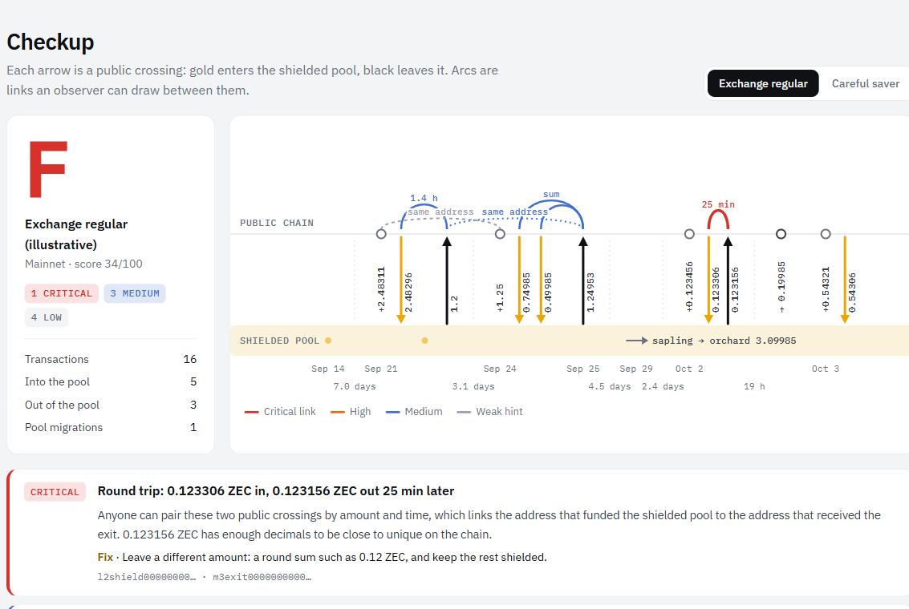

# Tells

**A privacy checkup for Zcash wallets.** Shielded transactions hide who paid whom and how much. How you *enter and leave* the shielded pool can still link your addresses together. Tells reads a wallet's history through its viewing key, on your own machine, and shows what an outside observer can connect. Run it before a withdrawal and it proposes a safer way to make it.

**Live:** https://luoy16002-svg.github.io/tells/



## Why

The first studies of the Zcash chain found that simple patterns undo most of the privacy people think they have:

- Matching amounts that go into the shielded pool with amounts that come out paired up **31.5%** of the coins sent into the pool, and **96%** of those round trips left within two hours ([Quesnelle, 2017](https://arxiv.org/abs/1712.01210)).
- A handful of such heuristics shrinks the anonymity set considerably ([Kappos, Yousaf, Maller, Meiklejohn, USENIX Security 2018](https://www.usenix.org/conference/usenixsecurity18/presentation/kappos)).

Wallets today warn about transparent addresses, but nothing tells a user *"this withdrawal will link you to the deposit you made an hour ago."* Tells does, before the transaction exists.

## What it checks

Only three things cross the pool boundary in public: an amount, a block time and a transparent address. Every rule uses nothing else, so every finding is something anyone reading the chain can also find.

| Rule | What it catches | Severity |
|---|---|---|
| Round trip | An exit within a fee (or 0.1%) of an earlier entry | Critical under 2 h, high under a day; up for unique amounts, down for round ones |
| Sum match | An exit equal to two or three recent entries added together | Like round trips |
| Quick exit | Leaving the pool within a day of entering, even with different amounts | High under 1 h |
| Fingerprint amounts | Crossings with four or more decimals (round amounts minus a fee count as round) | Low to medium |
| Address reuse | One transparent address on several crossings | Low to medium |
| Transparent payments | Transparent-to-transparent spends | Low to medium |
| Pool migrations | Sapling, Orchard and Ironwood moves publish their amount | Low |
| Crowd size | Look-alike exits by other people between your entry and your exit, read from compact blocks | Lowers a link by one or two levels |

**Pre-flight** takes a planned withdrawal (amount, time, destination), runs the same rules as if it had happened, and if it is risky proposes alternatives: wait, send a round amount and keep the remainder shielded, split, or use a fresh address. Every alternative is re-checked before it is shown.

## Use it

### In the browser

Open the [live page](https://luoy16002-svg.github.io/tells/), look at the sample wallets, try the pre-flight, or drop your own `history.json` (made below). The page runs entirely client-side.

### On your own wallet

You need a **unified full viewing key** (`uview1...`), which can see your history but cannot spend, and the wallet's birthday height. With Node 22 or newer:

```bash
npx github:luoy16002-svg/tells scan --ufvk uview1... --birthday 2726400 --out history.json
```

This creates a view-only wallet in a temporary folder, syncs it from lightwalletd (`zec.rocks` by default) with [zcash-devtool](https://github.com/zcash/zcash-devtool), prints the checkup and writes `history.json` for the web page. If `zcash-devtool` is not on your PATH and you pass no `--devtool`, Tells downloads a build of the pinned upstream commit made by this repository's public [scanner workflow](.github/workflows/scanner.yml), and checks it against the release's `SHA256SUMS`. Behind a proxy, set `HTTPS_PROXY` and `NODE_USE_ENV_PROXY=1`.

Other commands:

```bash
tells report  <wallet-dir | history.json>
tells preflight <wallet-dir | history.json> --amount 0.75 --at 2026-10-04T12:00Z --to t1...
tells export  <wallet-dir> --out history.json
```

### In a wallet

The rules are a dependency-free TypeScript package (`packages/core`) that runs in a browser, Node or a mobile JavaScript engine:

```ts
import { preflight } from '@tells/core';

const check = preflight(history, { amount: 54_311_000, time: Date.now() / 1000, address: recipient });
if (check.verdict === 'risky') showWarning(check.findings[0].title, check.alternatives);
```

## How it is built

```
packages/core   rules, scoring, pre-flight (TypeScript, no dependencies, tested with vitest)
packages/cli    reads a zcash_client_sqlite wallet (Node's built-in SQLite), drives zcash-devtool for scans
apps/web        the checkup page (Vite, plain TypeScript, hand-drawn SVG timeline)
demo/           testnet histories made with real transactions
```

The CLI reads `v_received_outputs`, `v_received_output_spends` and `sent_notes` from the wallet database to rebuild, per transaction, what the account spent and received in each pool (transparent, Sapling, Orchard, Ironwood). Crossings are derived from those flows the way an observer sees them: value entering or leaving the shielded pools, and moves between them.

## Privacy model

- Tells never asks for a seed phrase or a spending key.
- The viewing key goes to `zcash-devtool` on your machine, which talks to a lightwalletd server like any light wallet does. Use `--server` to choose one you trust, or route over Tor with zcash-devtool's `--connection tor`.
- The web page has no backend. `history.json` is read in the browser and never sent anywhere.

## Limits

- Crowd size counts look-alike *exits* (compact blocks carry transparent output values). Entry amounts are not in compact blocks, so the crowd of look-alike *entries* is not measured yet.
- Amount matching assumes standard fees (ZIP 317). Unusual fees can hide or create matches.
- It flags patterns that link transactions; it cannot prove that nobody linked them some other way (network-level metadata, exchange records).

## Business

- **Users** check for free: the page and the CLI stay open source.
- **Wallets and exchanges** integrate the pre-flight check, where it prevents the leak instead of reporting it. Integration support and an SLA-backed SDK are the paid product; custodial exchanges get a version that warns their customers before a TEX or transparent withdrawal.
- **Funds, OTC desks and journalists' organisations** that hold ZEC for privacy buy periodic audits of their treasury wallets, run on their own machines.
- The open core is a natural fit for Zcash ecosystem grants, which fund the first wallet integrations.

## Roadmap

- Entry-side crowd size, by resolving transparent inputs, and a mainnet dashboard of how linkable crossings are overall.
- WebAssembly scanning in the browser (WebZjs), so the whole checkup works without a terminal.
- Wallet integrations: a pre-flight hook for Zashi, Zingo and YWallet before they build a transaction to a transparent or TEX address.

## License

MIT. Built by [Kai Chen](https://luoy16002-svg.github.io/kai-works/) for the Colosseum Crypto World's Fair (Zcash track).
